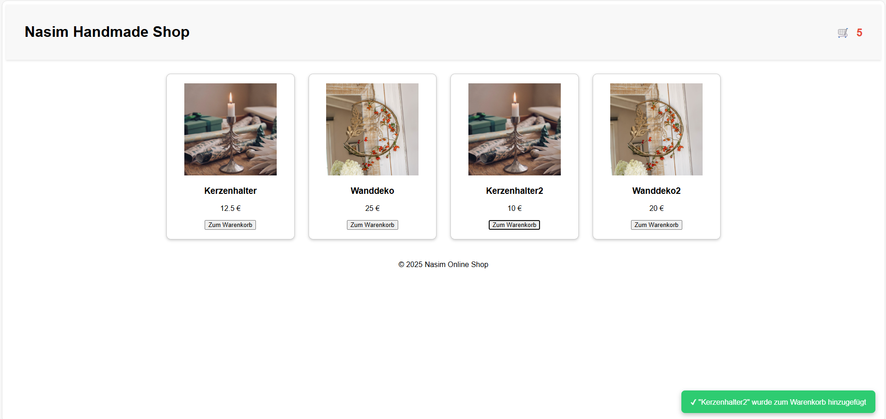
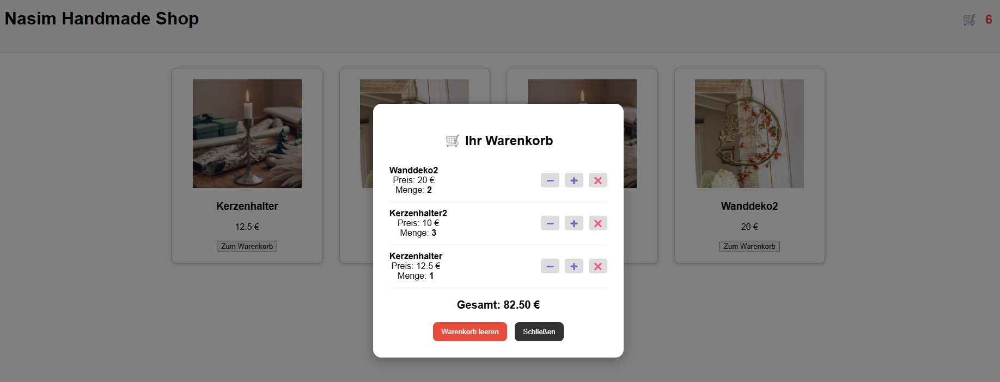

# 🛍️ Nasim Handmade Online Shop  

🔗 **Live Demo (Vercel):**  
https://produkt-galerie.vercel.app

Ein kleines, aber professionelles Webprojekt von **Nasim Molana**  
(Herstellerin von handgefertigten Dekorationsartikeln & Webentwicklerin)

Dieses Projekt zeigt eine interaktive Produktgalerie für handgemachte Dekoartikel – inklusive Warenkorb, Mengenverwaltung und lokalem Speichern (localStorage), ähnlich wie in echten Online-Shops.

---

## ✨ Features

### 🖼️ **1. Dynamische Produktgalerie**
- Produkte werden aus einer separaten `data.json` Datei geladen  
- Jedes Produkt wird dynamisch als DOM-Element erstellt  
- Enthält Bild, Name, Preis und Button *„Zum Warenkorb“*

<p align="center"></p>

---

### 🛒 **2. Professionelles Warenkorb-System**
- Produkte werden in den lokalen Speicher (localStorage) geschrieben  
- Mengenverwaltung (Quantity) pro Produkt  
- Erhöhen (+) und Verringern (–) der Menge  
- Entfernen einzelner Produkte  
- Gesamtsumme wird automatisch berechnet  
- Warenkorb bleibt nach Browser-Reload erhalten

<p align="center"></p>

---

### 🔔 **3. Toast Notifications**
Bei jedem Hinzufügen erscheint eine moderne Benachrichtigung:

> ✔ „Produkt wurde zum Warenkorb hinzugefügt“

---

### 🧮 **4. Live-Warenkorb Counter**
Im Header wird die Anzahl der Produkte immer aktuell angezeigt.

---

### 🎨 **5. Responsive & Elegantes Design**
- Produkt-Grid mit CSS Grid  
- Sanfte Hover-Effekte  
- Modale Darstellung des Warenkorbs  
- Professionelles Layout für ein kleines Shop-System  

---

## 📁 Projektstruktur

```
/online-shop/
│── index.html
│── style.css
│── onlineShop.js
│── data.json
│── /img/
│ └── kerzenhalter.png
│ └── wanddeko.jpg
│ └── preview_cart.png
│ └── preview_gallery.png
│── README.md
```


---

## 🛠️ Technologien

- **HTML5**
- **CSS3**
- **Vanilla JavaScript**
- **Fetch API**
- **LocalStorage**

Kein Framework – vollständig in purem JavaScript entwickelt.  
Ideal für Lehrzwecke und Portfolio-Projekte.

---

## 🚀 Installation & Start

1. Repository klonen:

```bash
git clone https://github.com/Molana2022/produkt-galerie.git


